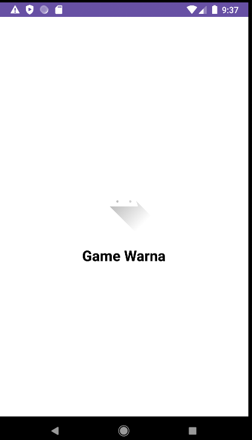
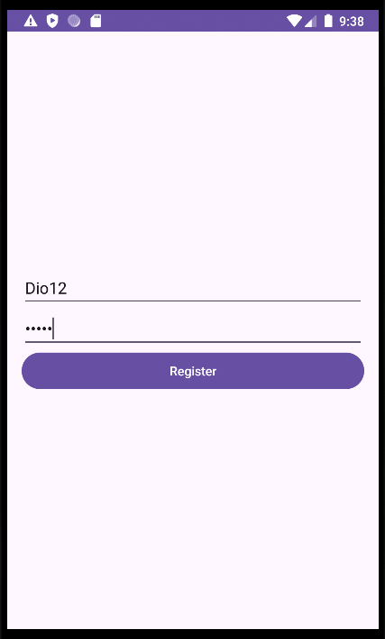
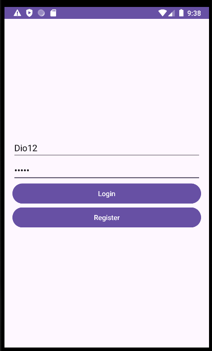
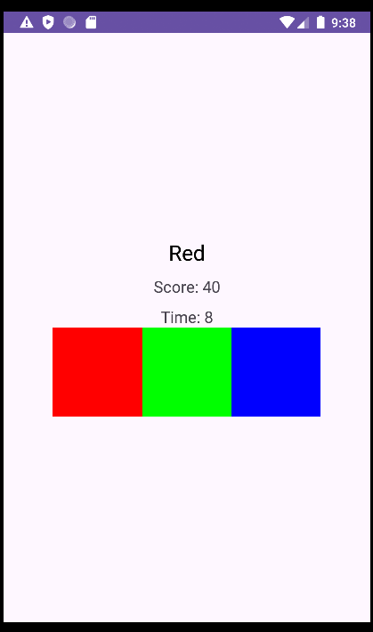
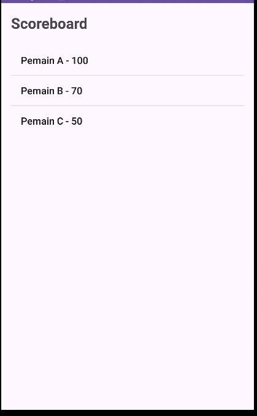
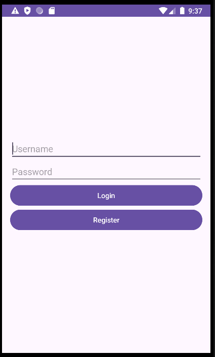

# UTS_PSB
Kode [Source](src) Aplikasi UTS Pemograman Sistem Bergerak

# Game Warna - Proyek Mini Pemrograman Sistem Bergerak

Repositori ini berisi kode-kode proyek mini untuk mata kuliah *Pemrograman Sistem Bergerak*. Proyek ini adalah aplikasi game warna sederhana, di mana pemain harus menekan warna yang sesuai dengan instruksi yang ditampilkan di layar.

## Fitur Utama

1. **Splash Screen**
   - Layar awal aplikasi dengan logo.
     

2. **Menu Login dan Registrasi**
   - Sebelum bermain, pengguna perlu membuat akun atau login.
     
     

3. **Landing Page**
   - Setelah login, pengguna diarahkan ke halaman utama yang menampilkan beberapa opsi: Bermain, Scoreboard, dan Keluar.
     

4. **Gameplay**
   - Pemain akan melihat tiga kotak warna dan satu instruksi warna. Tugas pemain adalah menekan kotak warna yang sesuai dengan instruksi.
   - Jika instruksi menyebutkan warna merah, pemain harus menekan kotak warna merah. Jika salah pilih warna, pemain akan kembali ke menu utama.
     

5. **Scoreboard**
   - Menampilkan skor yang dicapai oleh pemain setelah menyelesaikan permainan.
     

6. **Menu Keluar**
   - Tombol keluar akan membawa pengguna kembali ke halaman login.
     

## Cara Menggunakan Aplikasi

1. **Instalasi**: Clone repositori ini dan buka pada IDE pilihan Anda.
2. **Menjalankan Aplikasi**: Ikuti instruksi build pada IDE untuk menjalankan aplikasi di emulator atau perangkat nyata.
3. **Login atau Daftar**: Buat akun atau login untuk masuk ke aplikasi.
4. **Mulai Bermain**: Pilih warna yang benar berdasarkan instruksi, lihat skor di scoreboard, atau kembali ke menu login.

